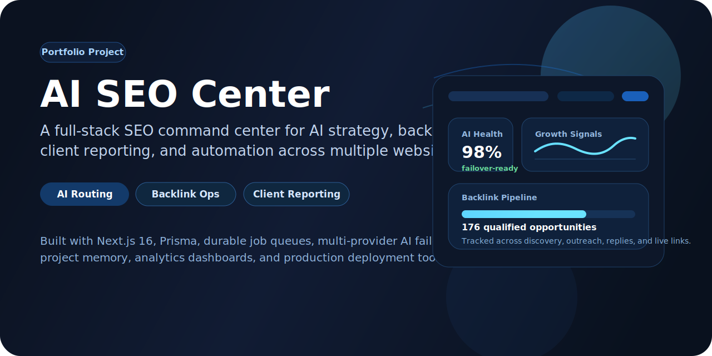
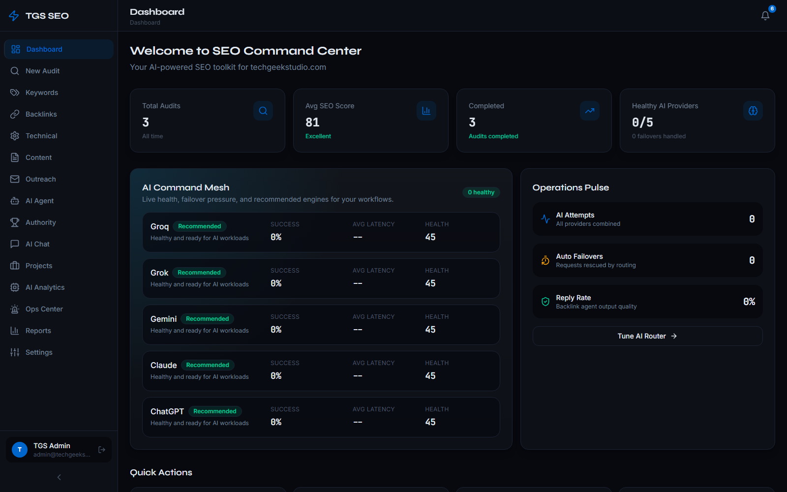
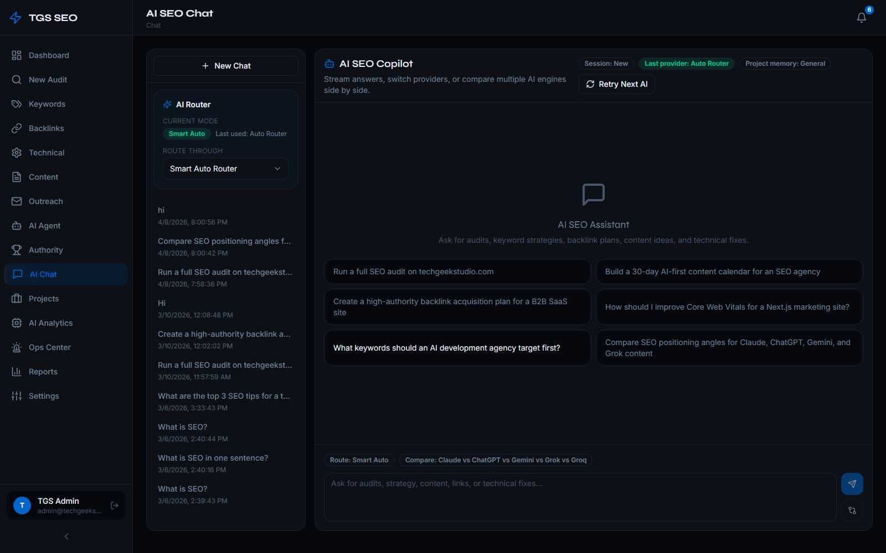
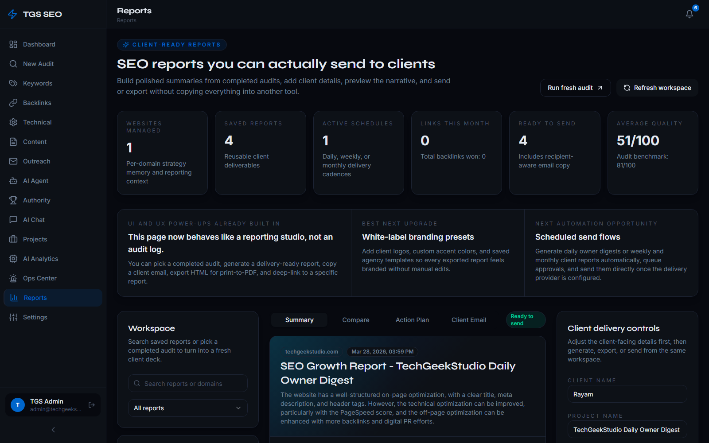
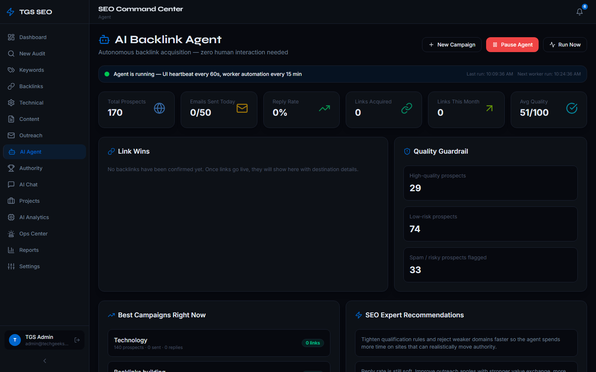

<p align="center">
  
</p>

<h1 align="center">AI SEO Center</h1>

<p align="center">
  <strong>An AI-powered SEO operations platform built to help teams run strategy, backlink outreach, reporting, and growth workflows from one place.</strong>
</p>

<p align="center">
  <a href="https://seoagent-techgeekstudio.vercel.app">Live Demo</a>
  ·
  <a href="docs/ARCHITECTURE.md">Architecture</a>
  ·
  <a href="docs/SRS.md">SRS</a>
  ·
  <a href="docs/DEPLOYMENT.md">Deployment</a>
</p>

## Why I Built This

Most SEO tools are good at showing data, but not great at helping a team actually run the work.

I wanted to build something closer to an internal growth operating system:

- a place where AI can help think through strategy
- a place where backlink operations can move like a real pipeline
- a place where reports feel client-ready instead of exported spreadsheets
- a place where automation, monitoring, and delivery all live together

AI SEO Center is my attempt to bring those pieces together into one product.

## Product Snapshots

<p align="center">
  
  
</p>

<p align="center">
  
  
</p>

## What the Product Does

<table>
  <tr>
    <td width="33%" valign="top">
      <h3>AI SEO Copilot</h3>
      <p>Runs across Claude, ChatGPT, Gemini, Grok, and Groq with provider failover, compare mode, and project-aware prompts.</p>
    </td>
    <td width="33%" valign="top">
      <h3>Backlink Operations</h3>
      <p>Tracks discovery, qualification, outreach, responses, and live link wins in a workflow that feels much closer to a sales pipeline than a static spreadsheet.</p>
    </td>
    <td width="33%" valign="top">
      <h3>Client Reporting</h3>
      <p>Builds structured SEO reports, recurring schedules, and delivery flows so the reporting side of the work feels polished too.</p>
    </td>
  </tr>
  <tr>
    <td width="33%" valign="top">
      <h3>Project Memory</h3>
      <p>Stores per-site brand voice, goals, backlink rules, competitor notes, and strategy context so AI responses stay grounded in the actual business.</p>
    </td>
    <td width="33%" valign="top">
      <h3>Ops + Reliability</h3>
      <p>Includes queue monitoring, provider health, incidents, scheduling, and worker flows so the product behaves like a system, not just a front-end demo.</p>
    </td>
    <td width="33%" valign="top">
      <h3>Publishing + Integrations</h3>
      <p>Supports CMS publishing paths and is structured to plug into Search Console, GA4, email delivery, and background job infrastructure.</p>
    </td>
  </tr>
</table>

## Case Study

### The Problem

SEO work often gets split across too many tools:

- one place for audits
- another for keyword thinking
- a spreadsheet for backlink tracking
- docs for reporting
- Slack or email for follow-up

That creates friction. Teams spend too much time managing the work instead of moving it forward.

### The Goal

Build a single command center that could help with:

- AI-assisted decision making
- backlink campaign execution
- recurring reporting
- project memory across multiple sites
- operational visibility into queues, providers, and background jobs

### What I Shipped

- a modular Next.js product with authenticated dashboards and API routes
- a multi-provider AI router with failover logic
- a backlink agent with qualification and outreach workflow support
- a reporting workspace with delivery and scheduling concepts
- project memory so every site can keep its own strategy context
- deployment tooling for Vercel and traditional server setups

### Product Thinking Behind It

I tried to make this feel like something a real agency or in-house growth team could grow into, not just something that looks good in screenshots.

That meant focusing on:

- clearer operational workflows
- safer automation paths
- human-readable error handling
- deployment readiness
- docs that explain the system like a product, not just a codebase

### Why This Project Matters in My Portfolio

This build shows the kind of work I enjoy most:

- full-stack product development
- AI feature integration
- system design and reliability thinking
- workflow-heavy SaaS UX
- turning a messy real-world process into software people can actually use

## Tech Stack

- `Next.js 16`
- `React 19`
- `TypeScript`
- `Prisma`
- `NextAuth`
- `Tailwind CSS`
- `SQLite` for local development
- Postgres-ready production workflow
- `Resend` for email delivery
- multi-provider AI orchestration

## Project Structure

- `app/`: UI routes and API routes
- `components/`: reusable interface building blocks
- `hooks/`: client-side data and polling hooks
- `lib/services/`: application services and orchestration
- `lib/agent/`: backlink automation engine
- `lib/prompts/`: AI behavior and prompt layers
- `lib/server/`: auth, queue, security, and observability helpers
- `prisma/`: schema, seed, and database workflow
- `tests/`: unit and browser-level testing
- `deploy/`: PM2, systemd, Nginx, and deployment scripts

## Running It Locally

```bash
pnpm install
cp .env.local.example .env.local
pnpm exec prisma db push
pnpm exec prisma generate
pnpm dev
```

Optional worker process:

```bash
pnpm jobs:drain
```

## Quality Checks

```bash
pnpm lint
pnpm exec tsc --noEmit
pnpm test
pnpm test:browser
pnpm build
```

## Documentation

- [Documentation Index](docs/README.md)
- [Software Requirements Specification](docs/SRS.md)
- [Architecture](docs/ARCHITECTURE.md)
- [ERD](docs/ERD.md)
- [Feature Catalog](docs/FEATURES.md)
- [API Overview](docs/API.md)
- [Deployment Guide](docs/DEPLOYMENT.md)

## Engineering Review Pack

- [Engineering Review (Markdown)](docs/reviews/seo-command-center-engineering-review-2026-04-09.md)
- [Engineering Review (PDF)](docs/reviews/seo-command-center-engineering-review-2026-04-09.pdf)
- [Engineering Review (DOCX)](docs/reviews/seo-command-center-engineering-review-2026-04-09.docx)
- [Engineering Review (PPTX)](docs/reviews/seo-command-center-engineering-review-2026-04-09.pptx)

## Final Note

This project is still the kind of system I’d keep iterating on.

There’s a lot more I’d love to add over time, especially deeper analytics integrations, more autonomous workflows, and richer client collaboration tools. But even in its current state, it represents a serious end-to-end product build with real engineering depth behind it.
