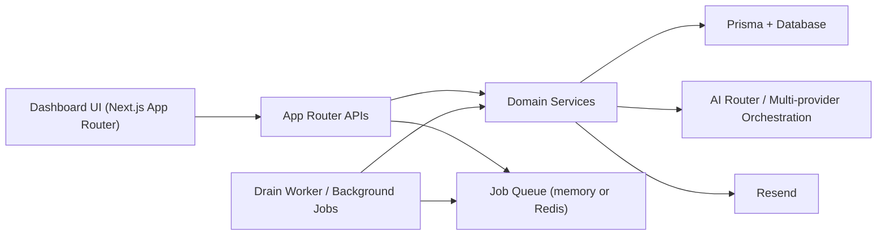
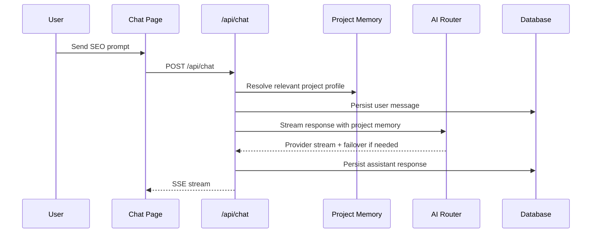
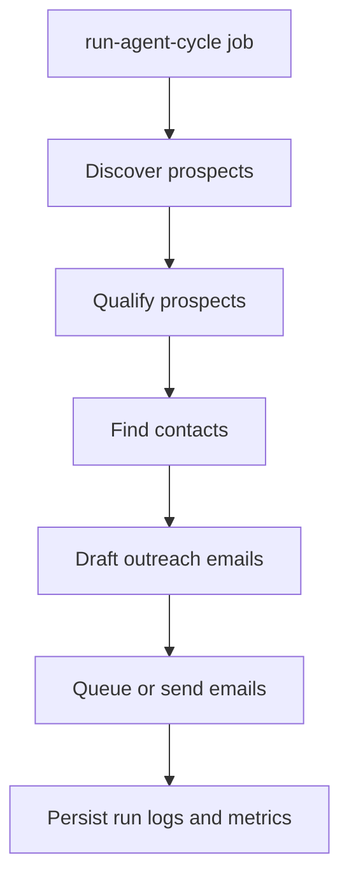
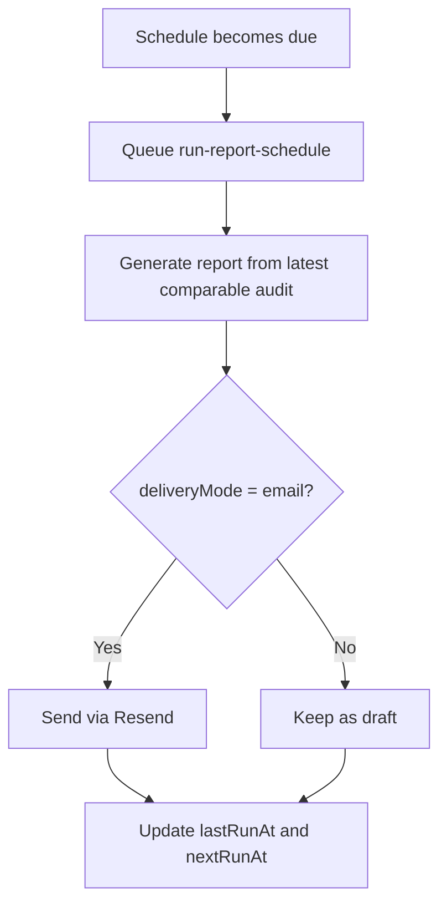

# Architecture

## 1. Overview

SEO Command Center is a Next.js App Router application with:
- server-rendered dashboard pages
- route-handler APIs
- Prisma persistence
- an AI provider router
- queue-backed background processing
- per-website project memory

It is designed as a modular SEO operations platform rather than a single workflow tool.

## 2. High-Level Architecture

## 3. Main Subsystems

### 3.1 Presentation Layer

Located mainly under `app/(dashboard)`.

Key pages:
- `/dashboard`
- `/chat`
- `/projects`
- `/agent`
- `/reports`
- `/ops`
- `/ai-analytics`
- `/settings`

### 3.2 API Layer

Located under `app/api`.

Responsibilities:
- validate input with `zod`
- require auth where needed
- call service-layer logic
- return consistent success/error structures

### 3.3 Service Layer

Key services include:
- audit service
- campaign service
- report service
- report automation service
- project profile service
- agent automation service

Responsibilities:
- business logic
- Prisma access orchestration
- queue-enqueue decisions
- reusable domain behavior

### 3.4 AI Orchestration Layer

Implemented in `lib/anthropic.ts`.

Capabilities:
- provider registry
- key resolution from DB or environment
- model override support
- cooldown handling
- automatic fallback
- telemetry capture
- provider health scoring

Supported providers:
- Claude
- ChatGPT
- Gemini
- Grok
- Groq

### 3.5 Automation / Queue Layer

Implemented in `lib/server/job-queue.ts` and `scripts/drain-jobs.ts`.

Modes:
- database-backed durable queue
- in-memory local queue
- Upstash Redis REST-backed queue path

Job types:
- `process-audit`
- `send-report-email`
- `run-report-schedule`
- `run-agent-cycle`

### 3.6 Persistence Layer

Prisma schema in `prisma/schema.prisma`.

Main data domains:
- users and auth
- audits
- reports and delivery
- project profiles
- chats
- outreach
- backlink campaigns/prospects/email queue
- agent config and runs
- AI telemetry

## 4. Important Runtime Flows

### 4.1 AI Chat Flow

### 4.2 Backlink Agent Cycle

Each stage uses campaign context plus project memory where relevant.

### 4.3 Report Schedule Flow

## 5. Security Model

- auth-protected dashboard and private APIs
- encrypted AI secrets in `AgentConfig`
- humanized but safer error messages
- server-side user scoping for audits, reports, chats, campaigns, and project profiles

## 6. Scalability Notes

### Current Good Foundations

- service-oriented route structure
- queue abstraction with durable database-backed jobs
- telemetry capture
- indexed query paths
- provider fallback and cooldown behavior
- browser-level regression coverage for key dashboard workflows

### Current Constraints

- local default DB is SQLite unless environment is changed
- SQLite is still the default local runtime, so true production concurrency needs PostgreSQL
- report sending depends on Resend configuration
- some external integrations rely on service-account or webhook credentials being supplied by the operator

## 7. Recommended Next Architectural Steps

- move production queue processing to a shared queue or workflow engine when multiple workers/process pools are introduced
- add repository abstractions if Prisma usage grows much further
- add provider-specific sync health dashboards for GSC, GA4, and CMS connections
- add background worker supervision so `jobs:drain` runs as a managed service outside development
- promote PostgreSQL as the production default and add migration/backup runbooks
