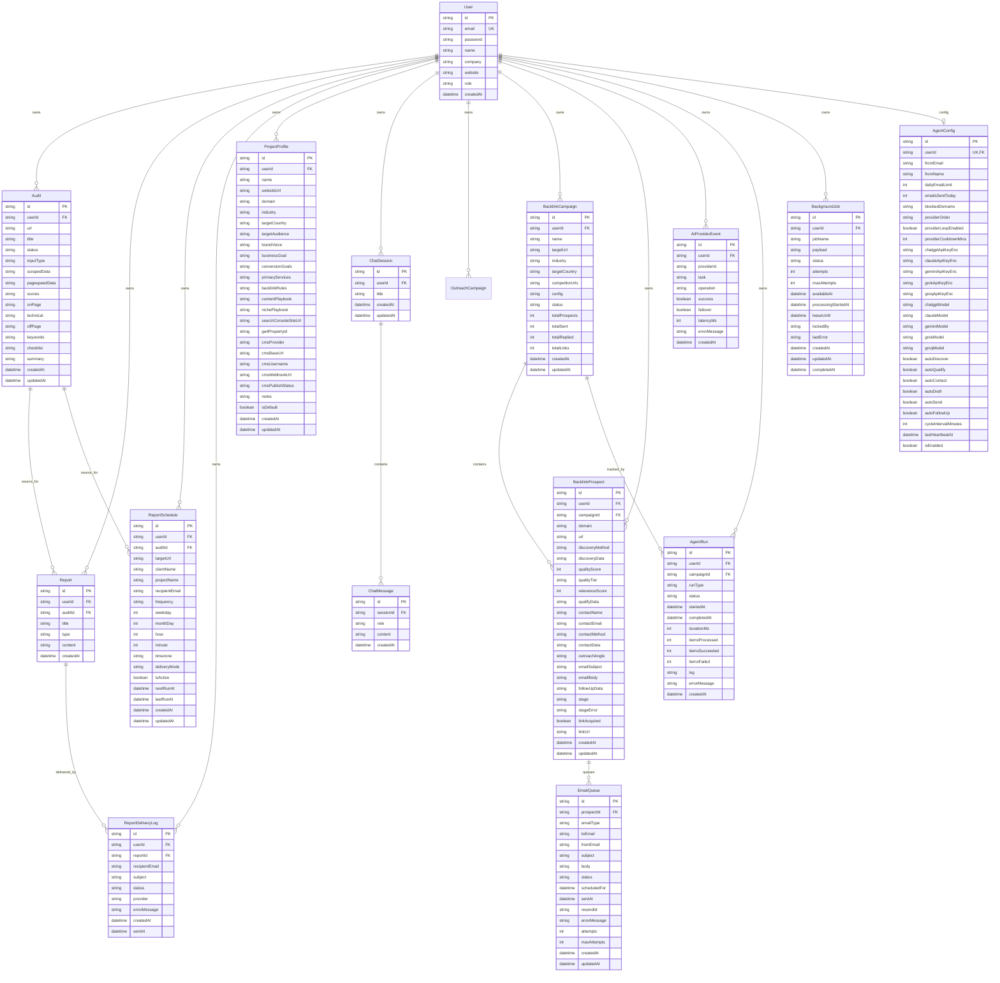

# Entity Relationship Diagram

## 1. Overview

The data model is organized into these main domains:
- user and configuration
- audits and reporting
- project memory
- AI chat
- outreach and backlink automation
- AI telemetry
- background jobs / queue state

## 2. ERD

## 3. Modeling Notes

- `AgentConfig` is the per-user operational control center for AI routing and automation toggles.
- `ProjectProfile` is the persistent strategy-memory layer used by chat and automation.
- `Report.content`, `Audit.scores`, `Audit.onPage`, and several other fields intentionally store structured JSON strings to keep the schema flexible.
- `BacklinkProspect` is the central record in the backlink workflow and connects discovery, qualification, outreach, and delivery.
- `AIProviderEvent` is append-only telemetry for AI health and analytics.
- `BackgroundJob` is the durable queue ledger for async work and supports retries, leases, and dead-letter handling.

## 4. Important Indexed Paths

Examples of high-value indexes already present:
- `Audit(userId, createdAt desc)`
- `Audit(userId, status, createdAt desc)`
- `ChatSession(userId, updatedAt desc)`
- `ReportSchedule(isActive, nextRunAt)`
- `BacklinkProspect(userId, stage, createdAt desc)`
- `BacklinkProspect(campaignId, linkAcquired)`
- `AIProviderEvent(userId, providerId, createdAt)`

These support dashboards, queues, reporting cadence, and AI health views.
